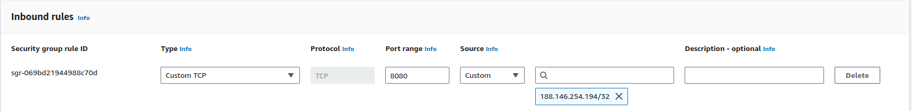
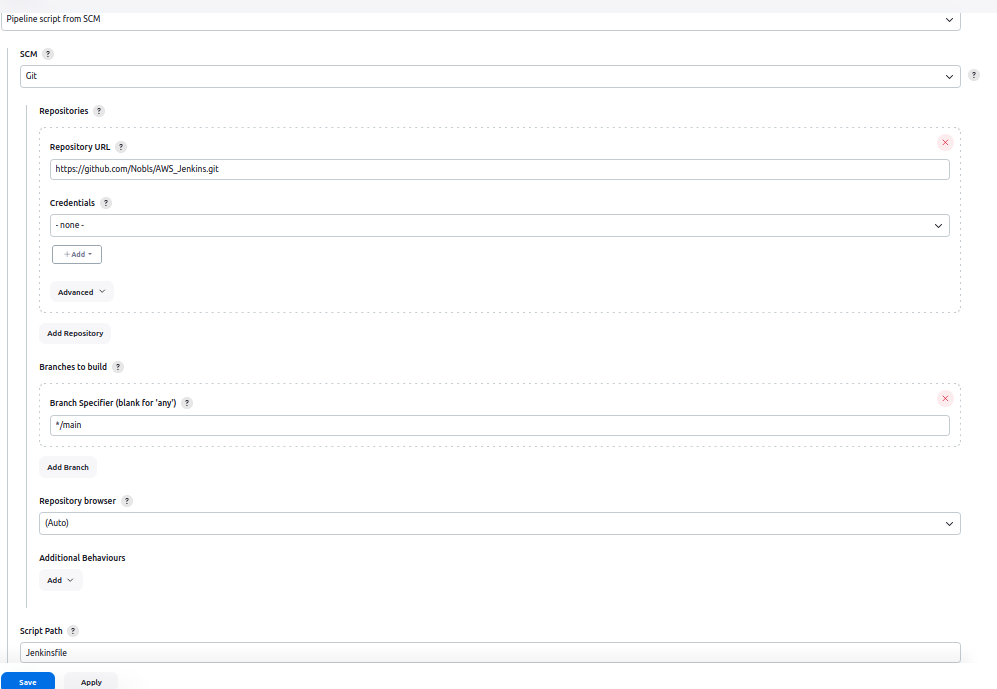
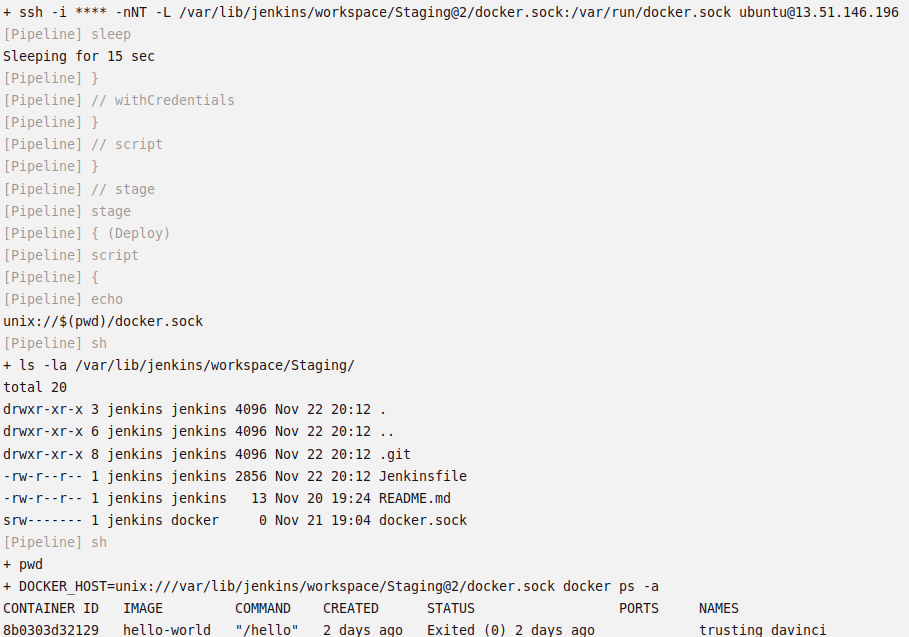

# Часть 3 — Работа с контейнерами

## 1) Создаем 2 инстанса 

## 2) В Security Group добавляем порт 8080, 22, 80, 443 для своего IP.



устанавливаем jenkins c помошью скрипта

```sudo apt-get update
sudo apt-get install openjdk-17-jdk
sudo apt-get update
sudo wget -O /usr/share/keyrings/jenkins-keyring.asc \
  https://pkg.jenkins.io/debian-stable/jenkins.io-2023.key
echo deb [signed-by=/usr/share/keyrings/jenkins-keyring.asc] \
  https://pkg.jenkins.io/debian-stable binary/ | sudo tee \
  /etc/apt/sources.list.d/jenkins.list > /dev/null
sudo apt-get update
sudo apt-get install jenkins
```
## 4) ssh подключение к Jenkins истансу

Создаем ключи под пользователем Jenkins с помошью команды
```
ssh-keygen -t rsa -b 2048
```
Берем публичный ключ и копируем его в Staging инстанс в 
```
.ssh/authorized_keys
```

## 5) Установка Docker на оба instance

Устанавливаем Докер с помошью следующих команд
```
#cкачивание скрипта установки Docker 

curl -fsSL https://get.docker.com -o get-docker.sh

#установка Docker

sudo sh get-docker.sh

#добавляем пользователя ubuntu в группу Docker

sudo usermod -aG docker ubuntu

```

## 6) Запуск sudo docker run hello-world в Staging instance. 

## 7) Создание репозитория в GitHub. Добавление в него Jenkinsfile.
Добавиление в Jenkinsfile скрипт из методички
прописал IP
```
STAGE_INSTANCE = "ubuntu@13.51.146.196"
``` 

## Создаем item и запускаем



